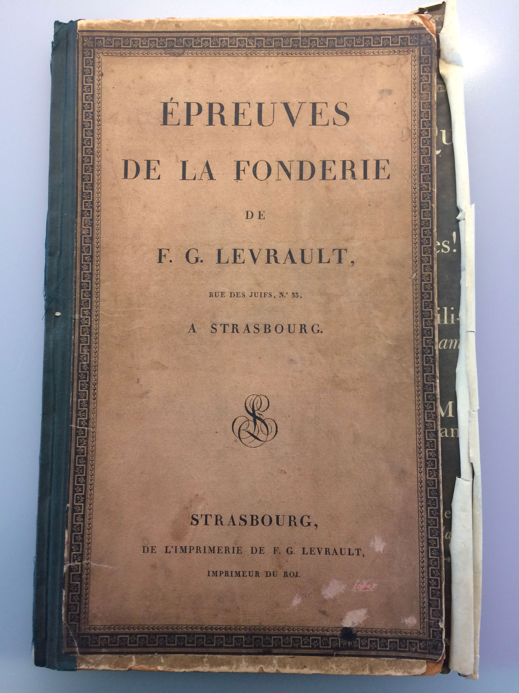
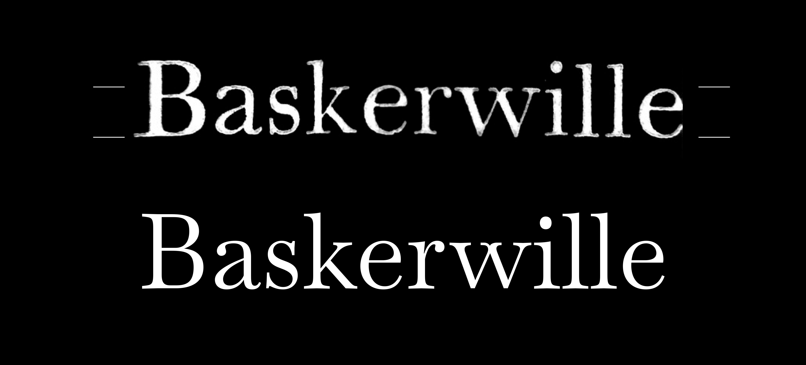

# Baskervville

This is the repository of the production process of Jacob's Baskerwille revival made at the ANRT in 2017/2018.

___

**Organization:** [ANRT](https://anrt-nancy.fr/fr/presentation/) (Atelier National de Recherche typographique), Nancy.

**Director:** Thomas Huot-Marchand.

**Teachers:** Charles Mazé, Jérémie Hornus, Jérôme Knebusch, Émilie Rigaud, Alice Savoie.

**Students/Researchers Promo 2017:** Alexis Faudot, Rémi Forte, Morgane Pierson, Rafael Ribas, Tanguy Vanlæys & Rosalie Wagner.

**Workshop:** From 2017.10.12 to 2017.10.20.

**Development and production:** Rosalie Wagner

_____
### Repository

* [Charset & specimen](documents/proofs)
* [Workshop process](https://github.com/anrt-type/ANRT-Baskervville/documents/workshop)
* [Fonts files](fonts/)
* [Glyphs sources](sources/)
* [Resources](documents/resources)

_____
### Resources

For this revival we used the sources from *La Notice historique de Berger-Levrault*, 1815.

We have a lot of other relevant resources but we are still organizing recent discoveries. Contact us if you have any request.

Thanks to credit everything you use in this repository with the mention : **ANRT (Atelier National de Recherche typographique), Nancy.**

_____

### The revival of a revival : from Baskerville to Baskerwille to Baskervville
*Baskervville* is a revival of Jacob's *Baskerwille*, itself revived from Baskerville's typeface. It was distributed by Berger-Levrault Foundry from 1815. The font Jacob produced was sold as a *"Caractères dans le genre Baskerwille"* i.e *"Baskerwille fonts alike"* — with a *w* instead of a *v*.

The particularity of Jacob's Baskerwille is that the roman is very closed to Baskerville's typefaces while the italic is closer to Didot's typefaces. The workshop aimed to digitalized Jacob's font in order to testify to his work which creates a transition between transitional and modern styles.

*Épreuves de la fonderie de F.G. Levrault*, Imprimerie Berger Levrault, Strasbourg, 1815.

The sources showed obvious inaccuracies due to the difficulty of producing and printing types in the 19th century. We didn't want to parody an historical typeface which would have reproduced irregularities from the paper, the ink nor the machine. So we tried to be true to what we thought were Jacob's purposess while using contemporary tools. However, we wanted to be able to use the font and for that matter we corrected some letter-shapes and proportions. We also had to guess the design of missing letters.

We kept that unusual *w*, which is twice a *v*, and made it the identity of Jacob's font. Jacob's Baskerwille is a strange double of Baskerville's typefaces; a "clone" which looks *alike* but which is not as achieved as its predecessor. This elementary duplication of the letter *v* signals, in a way, the counterfeiting.

*Comparison betwen Jacob's Baskerwille and ANRT's Baskervville* (ANRT Nancy 2018).

_____
### Build the font

1. Clone Baskervville's repository
2. Create a virtual environement
3. Activate the environment
4. Install `gftools` in the venv
5. Go to the `sources` dir of your lcoal clone: `cd path/to/repo/sources`
6. run `gftools builder Baskervville.glyphs Baskervville-Italic.glyphs`
_____
This font is collaborative and there is still much to do: you are welcome to download it, use it, and make comments. Feel free to pull requests and suggest improvement !
_____

### License
The fonts and related code are licenses under [Open Font License](http://scripts.sil.org/OFL). See LISENCE.txt for licensing information.
